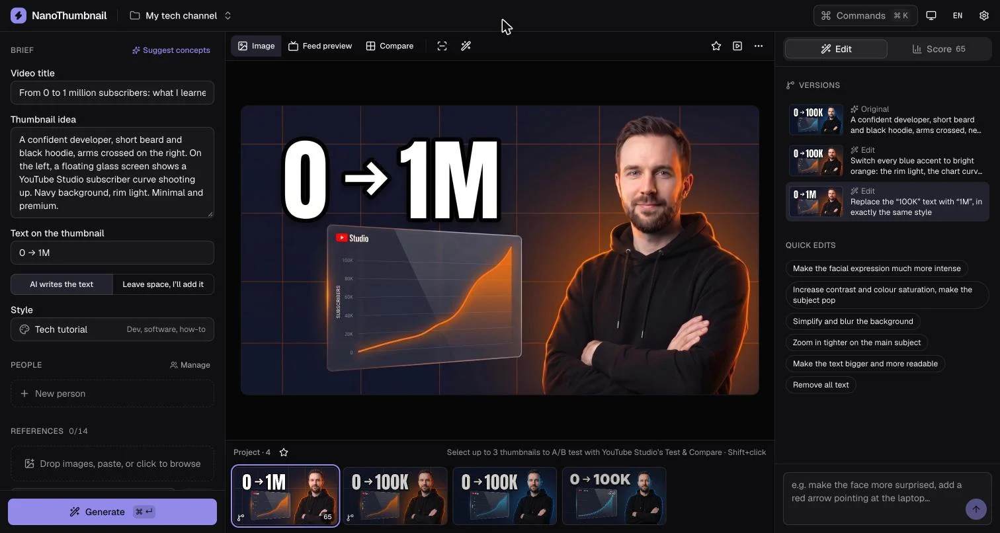
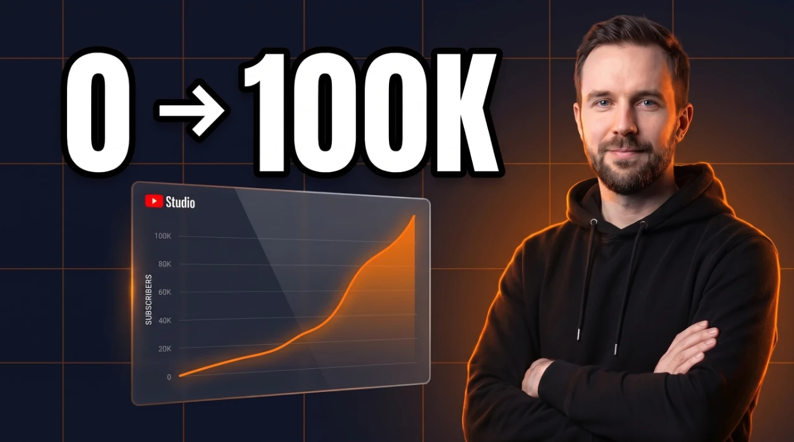
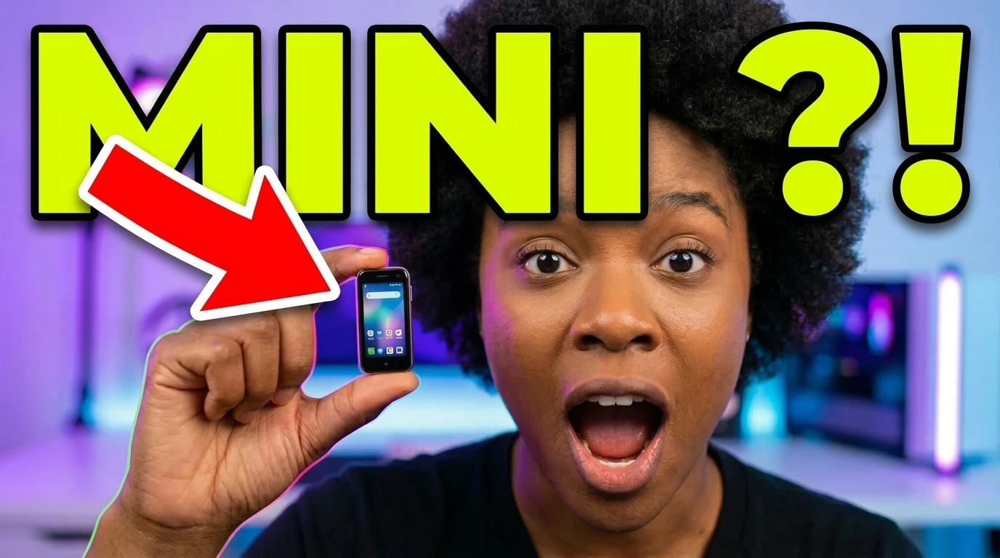

# NanoThumbnail

NanoThumbnail is a free, open-source studio to **generate, edit and test YouTube thumbnails** with Google's Nano Banana models (Nano Banana Pro and Nano Banana 2). It runs entirely in your browser: bring your own **Replicate**, **Google Gemini** or **OpenRouter** key, your images stay on your device.



**Live:** [nanothumbnail.com](https://nanothumbnail.com) · [Studio](https://nanothumbnail.com/app/) · [English](https://nanothumbnail.com/en/) / [Français](https://nanothumbnail.com/)

| Generate | Edit | Edit again |
|---|---|---|
|  |  |  |
| “Tech tutorial” style, text “0 → 100K” | “Switch every blue accent to bright orange” | “Replace ‘100K’ with ‘1M’, same style” |

## Features

**Create**
- **Brief-driven generation**: video title, scene, on-thumbnail text (rendered by the AI, or clean space left to add it yourself), 1–4 variants, 1K/2K/4K, 16:9, 9:16, 4:3 or 1:1.
- **14 proven styles**: reaction + object, versus, before/after, tech tutorial, cinematic documentary, hyper-saturated, 3D clay…
- **Concept assistant**: three genuinely different angles from your title, written in your language.
- **People**: save up to 5 people (front/profile photos plus expressions); their identity is preserved.
- **Brand kit**: colours, typography, logo, and a style profile distilled from your own best thumbnails.
- **References & YouTube remix**: up to 14 reference images, or paste a YouTube URL to pull its thumbnail and title.

**Iterate**
- **Conversational edits**: “make the face more surprised” changes only that. Every version is kept, with its lineage.
- **Area edits**: paint a mask, describe the change; the model gets the clean image plus a marked copy as a location guide, and pixels outside the mask are merged back untouched.
- **AI critique**: small-size legibility, contrast, focal point, emotion, curiosity, mobile readability, with one-click suggested edits. (A critique based on best practices — not a CTR prediction.)

**Test**
- **Feed preview**: home, search, up next, mobile and TV, light and dark, among your competitors' real thumbnails.
- **Safe zones**: duration badge, hover icons, progress bar, Shorts UI.
- **Compare & rank** variants side by side, then **export for YouTube Studio's Test & Compare** (1280×720, under 2 MB).

**AI agents (MCP)**
- Let Claude, Cursor or any MCP-capable agent drive the studio: brief, generate, edit (whole image or a region), critique, rank, export to disk. You watch every action live and can disconnect at any time.
- `claude mcp add nanothumbnail -- npx -y nanothumbnail-mcp`, then ask the agent to “open the NanoThumbnail studio” and click **Allow** once.
- Companion skill with the workflow and thumbnail craft: `npx skills add yoanbernabeu/NanoThumbnail --skill nanothumbnail`.

**Keyboard-first**
- `⌘K` command palette, `⌘↵` generate, `F` feed preview, `Z` safe zones, `M` mask, `Esc` leave mask.

**Local-first**
- Projects, images, people and brand kit live in IndexedDB. No account, no database.
- Installable PWA; the library works offline.
- One-click zip backup and restore.
- API key stored in the browser, or for the current session only.

## How it works

- **Gemini** is called directly from the browser (Google's API supports CORS). The key is sent in the `x-goog-api-key` header.
- **OpenRouter** is called directly from the browser too (`google/gemini-3-pro-image`, `google/gemini-3.1-flash-image`), with the key in the `Authorization` header.
- **Replicate** has no browser CORS support, so calls go through a small Netlify function (`netlify/functions/replicate-proxy.ts`). It only accepts requests from the site's own origin, only relays the three Replicate routes the app needs (create, poll, cancel), and never stores or logs anything.
- Reference images are downscaled client-side before upload, so requests stay small.
- Prompts are built as structured natural language following Google's Nano Banana prompting guidance (declared image roles, identity locks, “change only X, keep everything else” edits), see `src/app/lib/prompt.ts`.
- **AI agents**: the MCP server (`mcp/`, published as `nanothumbnail-mcp`) only relays tool calls over a WebSocket on `127.0.0.1` to the open studio tab, which runs them as store actions. Keys, projects and images never leave the browser. The socket accepts only the studio's origin and a pairing token; see [`mcp/README.md`](mcp/README.md).
- Critique, ranking, concepts and style analysis use Gemini 3 Flash (directly with a Gemini key, `google/gemini-3-flash` on Replicate, or `google/gemini-3.6-flash` on OpenRouter).

## Landing, SEO & GEO

- Static landing pre-rendered in French (`/`) and English (`/en/`), zero client JS, real studio screenshots per language.
- Lighthouse 100 / 100 / 100 / 100 (performance, accessibility, best practices, SEO) on mobile and desktop.
- Open Graph image per language, `hreflang`, JSON-LD (`WebApplication`, `FAQPage`, `WebSite`, `Person`), `sitemap.xml`.
- Agent-readable: [`/llms.txt`](https://nanothumbnail.com/llms.txt) and [`/llms-full.txt`](https://nanothumbnail.com/llms-full.txt) are generated at build time from the landing copy; `robots.txt` explicitly allows AI crawlers.

## Tech stack

- [Astro 7](https://astro.build/) — static site, CSP with script hashes, responsive images via `astro:assets`
- React 19 island for the studio (`/app`), [shadcn/ui](https://ui.shadcn.com/) + Radix, Tailwind CSS v4, Lucide icons, Zustand
- IndexedDB via `idb`, zip via `fflate`
- Vitest, GitHub Actions
- Netlify (static hosting + one function)

## Project structure

```
src/
├── app/                    # Studio (React island mounted on /app)
│   ├── App.tsx             # Layout, shortcuts, dialogs
│   ├── components/         # brief/, canvas/, iterate/, dialogs/, ui/ (shadcn)
│   ├── stores/             # Zustand: workspace, settings, ui
│   ├── lib/                # providers, prompt, ai, images, db, backup, migrate…
│   ├── agent/              # MCP bridge: tool definitions (protocol.ts), handlers, WebSocket client
│   └── i18n/               # en.ts, fr.ts (typed: a missing key fails the build)
├── assets/                 # Landing images and screenshots (fr-*/en-*), optimised at build
├── components/site/        # Landing page (static Astro, no JS)
├── site/                   # Landing copy (i18n.ts) and llms.txt generator (llms.ts)
├── layouts/                # SiteLayout (SEO, JSON-LD), AppLayout, LegalLayout
├── pages/                  # index, en/index, app, legal pages, sitemap.xml, llms.txt, llms-full.txt
└── styles/                 # tokens.css (light/dark), tailwind.css (studio), site.css (landing, inlined)
netlify/
├── functions/              # replicate-proxy, youtube-thumbnail-proxy
└── lib/origin.ts           # Origin allowlist
mcp/                        # nanothumbnail-mcp: stdio MCP server relaying to the studio
skills/nanothumbnail/       # Companion agent skill (skills.sh)
public/                     # sw.js, manifest, icons, og-{fr,en}.jpg, robots.txt
```

## Getting started

Prerequisites: Node.js 22+, and a [Replicate](https://replicate.com/account/api-tokens) or [Google Gemini](https://aistudio.google.com/apikey) or [OpenRouter](https://openrouter.ai/settings/keys) API key.

```bash
git clone https://github.com/yoanbernabeu/NanoThumbnail.git
cd NanoThumbnail
npm install
npm run dev          # http://localhost:4321
```

With `astro dev`, Gemini and OpenRouter work out of the box. To use Replicate locally, run `netlify dev` so the proxy function is available.

| Command | Description |
|---------|-------------|
| `npm run dev` | Development server |
| `npm run build` | Production build to `dist/` |
| `npm run preview` | Preview the production build |
| `npm test` | Unit tests (Vitest) |
| `npm run typecheck` | TypeScript check |
| `npm run check` | Typecheck + tests + build (what CI runs) |

## Upgrading from v1

Nothing to do: on first launch, v1 history, reference library and personas are imported into the new storage (the v1 database is left untouched), and API keys are carried over.

## License

MIT — see [LICENSE](LICENSE).

## Author

**Yoan Bernabeu** — [YoanDev.co](https://yoandev.co) · [@yOyO38](https://twitter.com/yOyO38)
